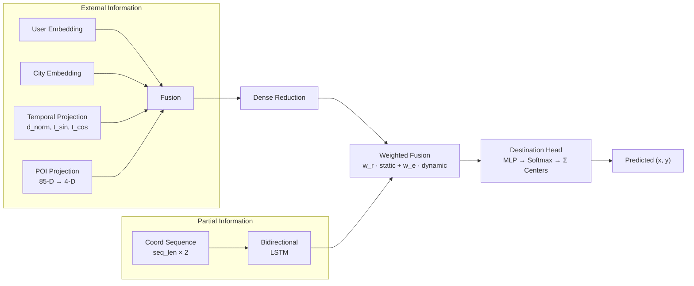

# PRD — CLNN v2: Human Mobility Prediction

## 1. Visão Geral

O **CLNN v2** é um sistema de predição de mobilidade humana desenvolvido para o [HuMob Challenge](https://connection.mit.edu/humob-challenge-2023). O modelo utiliza uma LSTM bidirecional combinada com fusão de informações externas (usuário, cidade, tempo, POIs) para prever a próxima localização (x, y) de um usuário em uma grade 200×200.

### Arquitetura Atual


### Stack Tecnológica
| Componente | Tecnologia |
|---|---|
| Framework ML | PyTorch 2.7 |
| GPU | CUDA 12.8 + cuDNN 9 |
| Dados | Parquet (PyArrow) ~4.5 GB |
| Tracking | MLflow |
| Container | Docker + NVIDIA Container Toolkit |
| Hardware alvo | NVIDIA RTX A4000 (16 GB VRAM) |

---

## 2. Estado Atual (o que já funciona)

| Funcionalidade | Status | Detalhes |
|---|---|---|
| Pipeline completo via YAML | ✅ | `run_automate.py` + 4 configs |
| KMeans cluster centers | ✅ | Até 512 clusters em coordenadas normalizadas |
| Treino base (cidade A) | ✅ | MSELoss, AdamW, AMP, ReduceLROnPlateau |
| Fine-tuning sequencial (B→C→D) | ✅ | CosineAnnealing, early stopping |
| Avaliação comparativa | ✅ | Zero-shot vs fine-tuned por cidade |
| Geração de submissão | ✅ | Parquet com rollout autoregressivo |
| Pred+GT pairs para análise | ✅ | Parquet com coordenadas normalizadas e discretizadas |
| Checkpointing e resumo | ✅ | `simple_checkpoint.py` |
| MLflow tracking | ✅ | Métricas, artefatos, plots |
| Docker GPU | ✅ | `humob:cu128` com entrypoint seguro |

### Bugs Conhecidos (recém-corrigidos)

- **Dataset com `sequence_length` longo** — O `IterableDataset` processava chunks isolados de 10K linhas, impossibilitando gerar sequências de 720 pontos. Corrigido com acumulação por usuário entre chunks e ajuste de `val_days` para `(0.78, 1.0)`.

---

## 3. O que Projetar Daqui para Frente

### 3.1 🔴 Prioridade Alta — Validação e Robustez

#### 3.1.1 Validação end-to-end após fix do dataset
> Reexecutar o pipeline completo com `exp_full_15d_a4000.yaml` (sequence_length=720) e confirmar que:
> - Loss de treino/validação são valores reais (não zero)
> - Avaliação produz amostras > 0 com MSE e cell error numéricos
> - Submissão gerada tem linhas > 0

#### 3.1.2 Testes unitários e de integração
> Não existem testes automatizados. Criar:
> - Testes do dataset (verifica que `__iter__` produz amostras para diferentes `sequence_length`)
> - Testes do modelo (verifica shapes de entrada/saída)
> - Teste smoke do pipeline (1 época, dados mínimos)

#### 3.1.3 Limpeza de checkpoints entre configs
> Problema encontrado: checkpoints de um config com `n_clusters=512` conflitam ao rodar com `n_clusters=16`. Implementar limpeza automática ou namespacing de checkpoints por config.

---

### 3.2 🟡 Prioridade Média — Melhorias de Modelo

#### 3.2.1 Hyperparameter tuning
> Os hiperparâmetros atuais são fixos no YAML. Oportunidades:
> - `n_clusters`: testar 128, 256, 512, 1024
> - `lstm_hidden`: atualmente 4 (muito pequeno para seq_len=720)
> - `fusion_dim`: atualmente 8
> - `user_emb_dim`: atualmente 4
> - `sequence_length`: comparar 12, 48, 120, 240, 720
> - Scheduler: testar OneCycleLR como alternativa

#### 3.2.2 Capacidade do modelo
> O modelo tem apenas **~413K parâmetros treináveis** — pode estar severamente subparametrizado para 100K usuários com sequências de 720 pontos. Considerar:
> - Aumentar `lstm_hidden` (4 → 32–64)
> - Aumentar `user_emb_dim` e `fusion_dim`
> - Multi-layer LSTM
> - Attention mechanism sobre a sequência (em vez de usar apenas o último hidden state)

#### 3.2.3 Transformer como alternativa à LSTM
> Para sequências longas (720 slots), um Transformer com positional encoding temporal pode capturar dependências de longo prazo melhor que a LSTM bidirecional atual.

#### 3.2.4 Melhor estratégia de fine-tuning
> O fine-tuning atual é sequencial (A→B→C→D), onde cada cidade parte do checkpoint anterior. Alternativas:
> - Fine-tuning independente (cada cidade parte sempre do base A)
> - Multi-task fine-tuning (treino simultâneo em B+C+D)

---

### 3.3 🟢 Prioridade Baixa — Infraestrutura e UX

#### 3.3.1 README.md completo
> O README atual está vazio (somente `# clnn_v2`). Documentar:
> - Descrição do projeto e da competição
> - Arquitetura do modelo
> - Como rodar (build Docker, configuração, execução)
> - Estrutura de diretórios
> - Resultados obtidos

#### 3.3.2 Organização de código
> Ajustes estruturais:
> - Mover modelos `.pt` da raiz para `outputs/models/`
> - Unificar `run.py` e `run_automate.py` (redundantes)
> - Consolidar scripts de avaliação (`scripts/evaluate.py`, `test_output.py`)
> - Melhorar `.gitignore` (adicionar `*.pt`, `outputs/`, `__pycache__/`)

#### 3.3.3 Análise de resultados offline
> Criar notebooks ou scripts dedicados para:
> - Visualização de trajetórias (predita vs real)
> - Análise de erros por período do dia, tipo de POI, padrão de mobilidade
> - Mapas de calor de erro por região da grade 200×200

#### 3.3.4 CI/CD e reprodutibilidade
> - Adicionar `docker-compose.yml` para facilitar execução
> - Fixar versões no `requirements.txt` (atualmente sem pinning)
> - Salvar config YAML dentro de cada checkpoint para rastreabilidade total

---

## 4. Proposta de Roadmap

| Fase | Itens | Estimativa |
|---|---|---|
| **Fase 1** — Validação | 3.1.1 + 3.1.2 + 3.1.3 | 1–2 dias |
| **Fase 2** — Capacidade | 3.2.2 + 3.2.1 | 2–3 dias |
| **Fase 3** — Documentação | 3.3.1 + 3.3.2 | 1 dia |
| **Fase 4** — Exploração | 3.2.3 + 3.2.4 + 3.3.3 | 3–5 dias |

---

## 5. Estrutura Atual do Projeto

```
clnn_v2/
├── config/                         # Configurações YAML
│   ├── smoke.yaml                  #   Teste rápido (seq_len=12, 1 época)
│   ├── big_smoke.yaml              #   Teste intermediário (seq_len=720, 8 épocas)
│   ├── exp_full_15d_a4000.yaml     #   Experimento completo para A4000
│   └── humob_config_15days.yaml    #   Config base 15 dias
├── src/
│   ├── data/
│   │   └── dataset.py              # HuMobNormalizedDataset (IterableDataset)
│   ├── models/
│   │   ├── humob_model.py          # HuMobModel (modelo principal)
│   │   ├── external_info.py        # ExternalInformationFusion + Dense
│   │   └── partial_info.py         # CoordLSTM
│   ├── training/
│   │   ├── train.py                # Treino base + evaluate_model
│   │   ├── finetune.py             # Fine-tuning + compare_models
│   │   └── pipeline.py             # Submissão + Pred+GT pairs
│   └── utils/
│       ├── mlflow_tracker.py       # MLflow wrapper
│       ├── simple_checkpoint.py    # Save/load/cleanup checkpoints
│       └── pytorch_compat.py       # Compatibilidade PyTorch
├── data/                           # Dados (Parquet ~4.5 GB)
├── outputs/                        # Modelos, submissões, plots, eval
├── scripts/                        # Scripts auxiliares (evaluate, train, setup_check)
├── run_automate.py                 # Runner principal (YAML → pipeline)
├── dockerfile                      # Docker com CUDA 12.8 + PyTorch 2.7
├── entrypoint.sh                   # Sanity check de GPU
└── requirements.txt                # Dependências Python
```
